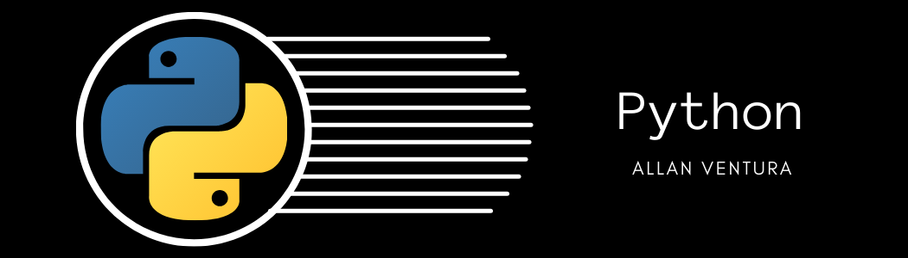

   

  

# Allan Ventura
*Engenheiro de Produção com pós em Big Data

Formado em engenharia de produção pela Universidade Federal Fluminense (UFF). Sou movido a novos desafios e entusiasta de Data Science. Realizo operações no mercado financeiro através de mecanismos de análise de dados. E atualmento faço uma pós graduação em Big Data.

Tive a oportunidade de estagiar na área de operações da Petrobras, aonde pude me interessar mais pela estatística e programação. Neste período realizei a automação de planilhas de controle através do VBA, auxiliei o gerenciamento do banco de dados, elaborei novos KPIs, mapeei o fluxo de determinadas operações e tive a oportunidade de liderar o projeto para a aplicação da manutenção baseada em risco no setor.

**Background in:** Python, Machine Learning, Business Intelligence and Industrial Engineering.

**Links:**
* [LinkedIn](https://www.linkedin.com/in/allanvrp)

## Projetos:

* **Desafio Elixir:** https://bit.ly/3d1VFIh
* **Verificar novos produtos na Hotmart:** https://bit.ly/3chPZuo

---

